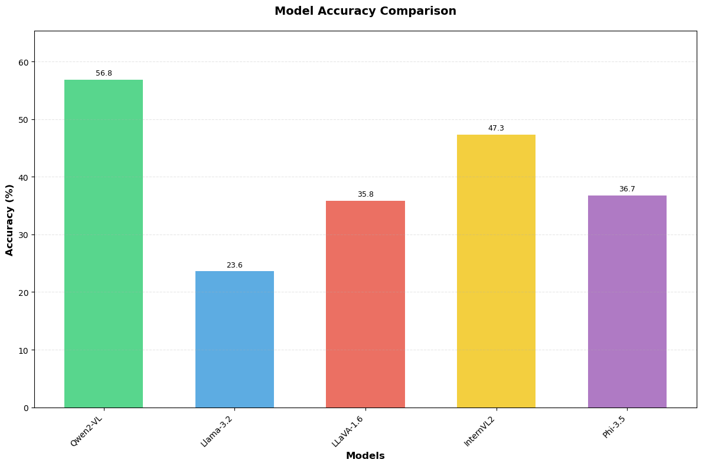
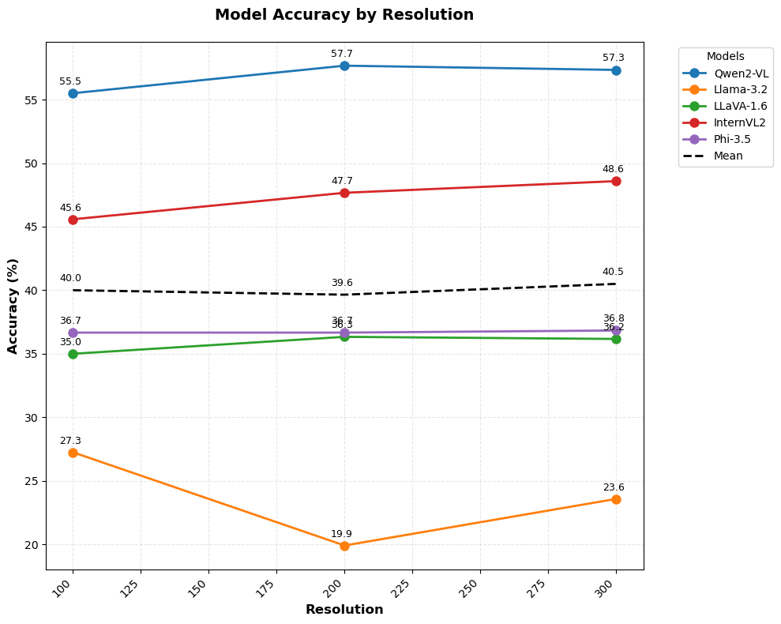
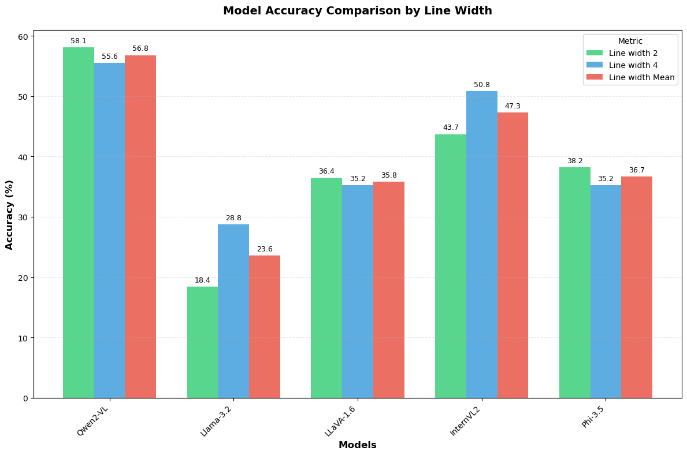
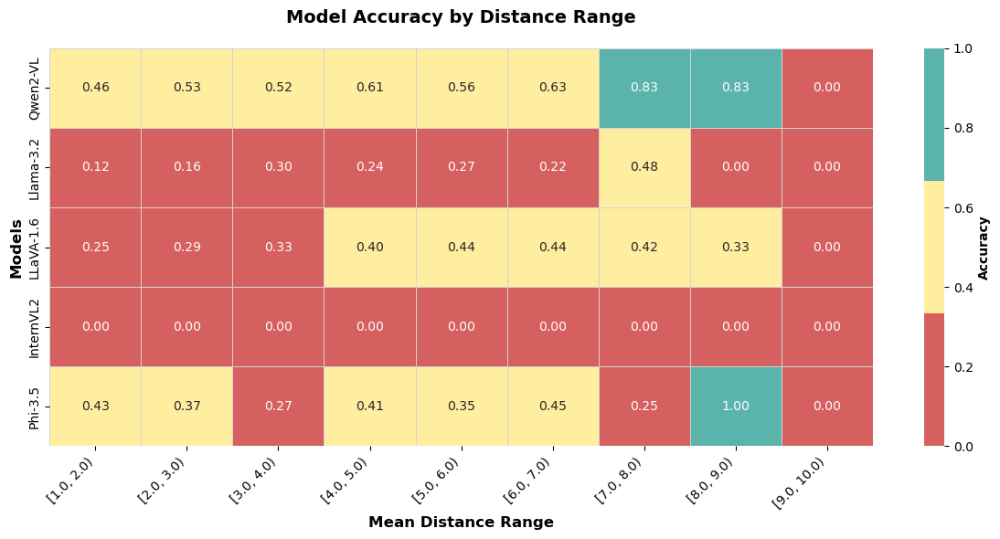

# vlms-are-blind-analysis
This repository evaluates certain opensource VLMs on the first task of the BlindTest benchmark as in the paper [Vision language models are blind](https://arxiv.org/abs/2407.06581) . The task is to count the number of intersections between two lines. The models are evaluated by zero-shot prompting on the test data provided by the benchmark.

<table class="image-table">
  <thead>
    <tr>
      <th colspan="2">Results</th>
    </tr>
  </thead>
  <tbody>
    <tr>
      <td></td>
      <td></td>
    </tr>
    <tr>
      <td></td>
      <td></td>
    </tr>
  </tbody>
</table>

## Instructions to set up the project locally
```bash
python3 -m venv env
```
Activating the environment on Windows:
```bash
env\Scripts\activate
```
Activating the environment on MacOS/Linux:
```bash
source env/bin/activate
```
Installing dependencies:
```bash
pip3 install -r requirements.txt
```

## Data
The data is generated by [./line_intersection_data.ipynb](./line_intersection_data.ipynb). The data is stored in [./my2DlinePlots](./my2DlinePlots) folder (not pushed to github). It's the exact data as used for the paper.

## Evaluation
Evaluation code is setup in [./evaluation.ipynb](./evaluation.ipynb):

The prompts are again the same as used in the paper.
1. How many times do the blue and red lines touch each other? Answer with a number in curly brackets, e.g., {5}.
2. Count the intersection points where the blue and red lines meet. Put your answer in curly brackets, e.g., {2}.

The `get_model_predictions()` function implements inference code for all models. Then a loop is setup that loads the model and processor and evaluates the model on the test data. The model's predictions are stored in a pandas dataframe. All of the code is taken and modified from respective model's documentation on HuggingFace.

The pandas dataframe will have the following columns for each of the 3600 rows:
- filename	
- gt
- linewidth
- resolution
- distances	
- image_path
- prompt
- Qwen/Qwen2-VL-7B-Instruct
- meta-llama/Llama-3.2-11B-Vision-Instruct
- llava-hf/llava-v1.6-mistral-7b-hf
- OpenGVLab/InternVL2_5-8B-MPO
- microsoft/Phi-3.5-vision-instruct

The model columns will store their predictions.

The 'instruct' variant models is chosen where available since they are optimized for VQA.

## Current Issues
- My request to test `google/paligemma2-3b-pt-224` isn't yet approved by google on HuggingFace.
